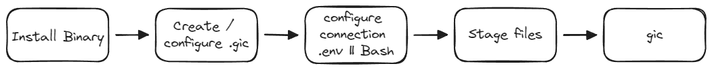

# GIt-Commit (gic)

Reducing cognitive load by automating commit message generation, allowing developers to focus on coding instead of crafting messages. A tool that helps developers generate git commit messages based on the `git diff` of staged files, following instructions. It's ideal for use alongside [Semantic Release](https://github.com/semantic-release/semantic-release).

## How to use it

The flow is simple. Install the binary, create a config (`.gic` or `.gic.yaml`) file in your project root, and run `gic` in your terminal. The tool will generate a commit message based on the staged files and the instructions provided in the `.gic` file.



### Install the binary

Run the following command to install the latest version of `gic`:

```bash
curl -sSfL https://raw.githubusercontent.com/jsburckhardt/gic/main/script/install-gic.sh | sh -s
```

or if you prefer, add the `devcontainer` feature to your `.devcontainer/devcontainer.json` file:

```json
    "features": {
        "ghcr.io/jsburckhardt/devcontainer-features/gic:1": {}
    }
```

### Create a `.gic` file

There are different options to create the config file.

- You can create it by using the [sample.gic.yaml](https://raw.githubusercontent.com/jsburckhardt/gic/main/sample.gic.yaml) file in the repository.

- The second option is to ask gic to create a basic config file. Run the following command in your terminal:

    ```bash
    gic --create-sample-config
    ```

### Generate a sample .env file

You can generate a sample .env file using the command line `gic`. Run the following command in your terminal:

```bash
gic --create-sample-dotenv
```

## Config file sample

```yaml
llm_instructions: |
  You are a commit message generator that follows the semantic release format based on Angular commit guidelines. The user will provide a git diff, and your task is to analyze the changes and generate a SINGLE appropriate git commit message. The message should clearly indicate the type of changes (e.g., feat, fix, chore, docs, style, refactor, test, build, ci, perf, or revert), a brief summary of the change in imperative mood, and optionally include a scope in parentheses. If applicable, include a body with additional details and a footer with references to any related issues or breaking changes.
  Commit message can have more than one scope and can be multiline.

  Use breaking change only and only if the change is a feature based on code changes.

  Example Format between ~~~:

  ~~~
  <type>(<scope>): <short description>

  [optional body]

  [optional footer(s)]
  ~~~

  return ONLY and ONLY the commit message with no ~~~.

  Example Usage:

  Input: git commit diff: ...
  Output: A commit message following the format based on the analysis of the diff.

  Example Commit Messages:

  feat(api): add new endpoint for user authentication
  fix(ui): resolve button alignment issue on mobile devices
  chore(deps): update dependencies to latest versions
  docs(readme): add instructions for setting up the project locally
  refactor(auth): simplify token validation logic
  test(auth): add unit tests for login functionality
  perf(core): improve rendering performance by optimizing the DOM updates
```

## Setting Environment Variables

To configure the LLM connection details, you need to set the following environment variables:

- `SERVICE_PROVIDER`: The service provider (e.g., "openai", "azure", "ollama").
- `OPENAI_API_KEY`: The OpenAI API key (required if `SERVICE_PROVIDER=openai`).
- `OPENAI_API_BASE`: The OpenAI API base URL (required if `SERVICE_PROVIDER=openai`).
- `OPENAI_DEPLOYMENT_NAME`: The OpenAI deployment name (default is "gpt-4o-mini").
- `AZURE_AUTHENTICATION_TYPE`: The Azure authentication type (e.g., "api_key", "azure_ad").
- `AZURE_OPENAI_API_KEY`: The Azure OpenAI API key (required if `SERVICE_PROVIDER=azure` and `AZURE_AUTHENTICATION_TYPE=api_key`).
- `AZURE_OPENAI_ENDPOINT`: The Azure OpenAI endpoint (required if `SERVICE_PROVIDER=azure`).
- `AZURE_OPENAI_DEPLOYMENT_NAME`: The Azure OpenAI deployment name (required if `SERVICE_PROVIDER=azure`).
- `OLLAMA_API_KEY`: The Ollama API key (required if `SERVICE_PROVIDER=ollama`).
- `OLLAMA_API_BASE`: The Ollama API base URL (required if `SERVICE_PROVIDER=ollama`).
- `OLLAMA_DEPLOYMENT_NAME`: The Ollama deployment name (default is "phi3").

You can set these environment variables in your terminal or in a `.env` file in the root of your project.

Example `.env` file:

```env
SERVICE_PROVIDER=openai
OPENAI_API_KEY=your_openai_api_key
OPENAI_API_BASE=https://api.openai.com/v1
OPENAI_DEPLOYMENT_NAME=gpt-4o-mini
AZURE_AUTHENTICATION_TYPE=api_key
AZURE_OPENAI_API_KEY=your_azure_openai_api_key
AZURE_OPENAI_ENDPOINT=https://your-azure-endpoint
AZURE_OPENAI_DEPLOYMENT_NAME=your-deployment-name
OLLAMA_API_KEY=your_ollama_api_key
OLLAMA_API_BASE=https://api.ollama.com/v1
OLLAMA_DEPLOYMENT_NAME=phi3
```

## Customizing the config

### Using Azure OpenAI resources

There are two common ways to authenticate with AOAI resources. The first one is by using a **api_key** and the second one is by using an **azure_ad** token.

- **api_key**: For this flow. You'll need to configure the set `SERVICE_PROVIDER` to `azure`. Add the details for `AZURE_OPENAI_ENDPOINT`, `AZURE_OPENAI_DEPLOYMENT_NAME`, and `AZURE_AUTHENTICATION_TYPE`. Additionally, you'll need to add the environment variable `AZURE_OPENAI_API_KEY` with the value of the key.

    ```yaml
    # .gic
    llm_instructions: |
        - Generate a commit message based on the staged files
        - follow semantic release guidelines
    ```

  #### Connection config

  - In the terminal option

    ```bash
    # In the terminal
    export AZURE_OPENAI_API_KEY=<api_key>
    export AZURE_OPENAI_ENDPOINT=<endpoint>
    export AZURE_OPENAI_DEPLOYMENT_NAME=<deployment_name>
    export AZURE_AUTHENTICATION_TYPE=api_key
    ```

  - Using the `.env` file

    ```env
    # .env
    AZURE_OPENAI_API_KEY=<api_key>
    AZURE_OPENAI_ENDPOINT=<endpoint>
    AZURE_OPENAI_DEPLOYMENT_NAME=<deployment_name>
    AZURE_AUTHENTICATION_TYPE=api_key
    ```

- **azure_ad**: For this flow. You'll need to configure the set `SERVICE_PROVIDER` to `azure`. Add the details for `AZURE_OPENAI_ENDPOINT`, `AZURE_OPENAI_DEPLOYMENT_NAME`, and `AZURE_AUTHENTICATION_TYPE`. Additionally, you'll need to assign the **Cognitive Services OpenAI User** role to any user that is going to consume the resource.

    ```yaml
    llm_instructions: |
        - Generate a commit message based on the staged files
        - follow semantic release guidelines
    ```

  #### Connection config

  - In the terminal option

    ```bash
    # In the terminal
    export AZURE_OPENAI_ENDPOINT=<endpoint>
    export AZURE_OPENAI_DEPLOYMENT_NAME=<deployment_name>
    export AZURE_AUTHENTICATION_TYPE=azure_ad
    ```

  - Using the `.env` file

    ```env
    # .env
    AZURE_OPENAI_ENDPOINT=<endpoint>
    AZURE_OPENAI_DEPLOYMENT_NAME=<deployment_name>
    AZURE_AUTHENTICATION_TYPE=azure_ad
    ```

### Using OpenAI resources

For this flow, you'll need to configure the set `SERVICE_PROVIDER` to `openai`. Add the details for `OPENAI_API_BASE`, `OPENAI_DEPLOYMENT_NAME`. Additionally, you'll need to add the environment variable `OPENAI_API_KEY` with the value of the key.

```yaml
llm_instructions: |
    - Generate a commit message based on the staged files
    - follow semantic release guidelines
```

#### Connection config

- In the terminal option

    ```bash
    # In the terminal
    export OPENAI_API_KEY=<api_key>
    export OPENAI_API_BASE=https://api.openai.com/v1
    export OPENAI_DEPLOYMENT_NAME=gpt-4o-mini
    ```

- Using the `.env` file

    ```env
    # .env
    OPENAI_API_KEY=<api_key>
    OPENAI_API_BASE=https://api.openai.com/v1
    OPENAI_DEPLOYMENT_NAME=gpt-4o-mini
    ```

### Using LLMs hosted in Ollama Locally in your devcontainer (or any machine)

>[!NOTE]
>When using Ollama, it mounts the model to memory the first time you run it, which can take some time. After 5 minutes of inactivity, Ollama offloads the model.

Here is an example to run `ollama` in your `devcontainer` and pulling phi3.5 image.

```json
...
// add this args to load the GPUs to your devcontainer
"runArgs": [
 "--gpus", "all"
],
// add the ollama feature and pull a model e.g. phi3.5
"features": {
    "ghcr.io/prulloac/devcontainer-features/ollama:1": {
        "pull": "phi3.5"
    },
},
...
```

In your `.gic` config you would add:

```yaml
llm_instructions: |
    - Generate a commit message based on the staged files
    - follow semantic release guidelines
```

```bash
# In the terminal
export OLLAMA_API_KEY=<api_key>
export OLLAMA_API_BASE=https://api.ollama.com/v1
export OLLAMA_DEPLOYMENT_NAME=phi3
```

```env
# .env
OLLAMA_API_KEY=<api_key>
OLLAMA_API_BASE=https://api.ollama.com/v1
OLLAMA_DEPLOYMENT_NAME=phi3
```

## Different outputs per model

>[!CAUTION]
>When choosing a model validate the instructions and generation matches what you expect. As an example, noticed phi3.5 didn't really generated a commit message with the requested instructions. More details in [here](#different-outputs-per-model).

For this sample we are doing some Documentation changes in the `README.md` file. The instructions are the same for all models.

Instructions:

```yaml
llm_instructions: |
    - Generate a commit message based on the staged files
    - follow semantic release guidelines
```

### phi3.5

```bash
commit message: ```\nGenerate a commit message for staged files following semantic release guidelines using Ollama locally or Azure Cognitive OpenAI service. The tool, configured through `.gic` config file, auto-generates messages to streamline the process and maintain consistency in your project's history.\n```
```

### gpt-4o

```bash
commit message: docs: update README with detailed usage instructions and config options\n\n- Reorganized sections for better clarity and usability\n- Added installation instructions for the `gic` binary\n- Provided steps for creating and customizing the `.gic` config file\n- Included guidance on using Azure OpenAI resources with different authentication methods\n- Detailed instructions on using LLMs hosted locally via Ollama\n- Enhanced documentation with images and sample commands"
```
